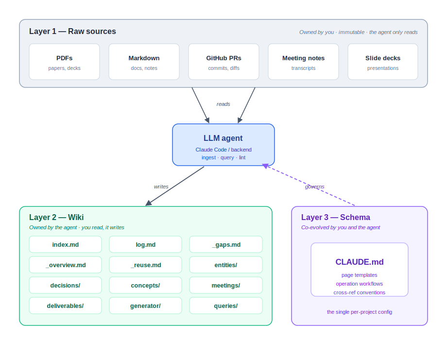

# The Living Project Wiki

A GenAI system that turns the heterogeneous artefacts of a project — meeting notes,
design decisions, code, and presentations — into a **structured, cross-referenced,
continuously-updated knowledge base**.

Built as a BSc Business Analytics thesis with **KickstartAI**. Inspired by Andrej
Karpathy's [*LLM wiki*](https://gist.github.com/karpathy/442a6bf555914893e9891c11519de94f)
pattern: instead of having a language model re-read raw documents on every query (as
conventional RAG does), the system **compiles knowledge once** into a persistent wiki and
keeps it updated — so understanding accumulates over a project's life rather than being
rediscovered on each question.

---

## Architecture

<p align="center">
  
</p>

The system is built on a **schema-governed, three-layer architecture** that strictly
separates data, knowledge, and configuration:

- **Layer 1 — Sources** (`/sources`): the raw project artefacts. Immutable; the LLM only
  reads them, preserving a verifiable ground truth.
- **Layer 2 — Wiki** (`/wiki`): the LLM-generated, cross-referenced Markdown pages
  (entities, decisions, concepts, meetings, deliverables). Owned by the agent — you read
  it, it writes it.
- **Layer 3 — Schema** (`CLAUDE.md`): the configuration that governs how the agent reads
  documents and maintains the wiki — page templates, operation workflows, and
  cross-referencing conventions.

An LLM agent performs four operations: **Ingest** (compile a source into wiki pages),
**Query** (answer questions from the wiki), **Generate** (digests, onboarding summaries,
reports), and **Lint** (wiki health check).

---

## Repository structure

```
.
├── CLAUDE.md              # Layer 3 — the schema that governs the agent
├── backend/              # FastAPI backend (the four operations, powered by the Anthropic API)
├── frontend/             # React + TypeScript + Vite single-page app
├── sources/              # Layer 1 — raw sources, one subtree per project (e.g. sources/uva/)
├── wiki/                 # Layer 2 — generated wiki, one subtree per project (e.g. wiki/uva/)
├── permission-layer/     # Access-control assets (per-project blacklists)
├── evaluation/           # Wiki-vs-raw-context experiment (conditions, metrics, question set)
├── access_labels.json    # Permission labels per document / wiki page
├── audit_log.md          # Permission-layer self-audit trail
└── token_usage.md        # Per-ingest token / cost ledger
```

---

## Local setup

### Prerequisites
- **Python 3.9+**
- **Node.js 18+**
- An **Anthropic API key** ([console.anthropic.com](https://console.anthropic.com))

### 1. Clone and configure

```bash
git clone https://github.com/Lruckens/kickstartai-living-wiki-multi.git
cd kickstartai-living-wiki-multi
cp .env.example .env          # then open .env and set ANTHROPIC_API_KEY
```

### 2. Start the backend

```bash
cd backend
python -m venv .venv && source .venv/bin/activate    # optional but recommended
pip install -r requirements.txt
uvicorn main:app --reload --port 8010
```

The API is now running at **http://localhost:8010**.

### 3. Start the frontend

In a second terminal:

```bash
cd frontend
npm install
npm run dev
```

Open the URL Vite prints (default **http://localhost:5173**). The frontend talks to the
backend at `http://localhost:8010` — override with `VITE_BACKEND_URL` if needed.

---

## Using the app

- **Ingest** — add a `.md` / `.pdf` source to `sources/<project>/` (or upload it in the UI);
  the agent reads it and compiles it into cross-referenced wiki pages.
- **Query** — ask a question; the system retrieves the relevant wiki pages and answers with
  citations.
- **Generate** — produce a weekly digest, onboarding summary, progress report, or LinkedIn
  draft for a chosen audience.
- **Lint** — run a wiki health check (contradictions, orphan pages, gaps).

---

## Permission layer

Runs after the ingestion pipeline and wiki generation, controlling what gets produced and
what gets shared. Enforced at two points, not as a separate settings page:

- **Pre-filtering** — every source document and wiki page carries a label (`public` /
  `internal` / `restricted`) and, if restricted, a `project_id`, stored in
  `access_labels.json`. Before any generation call, the source pool is filtered
  deterministically to what the target level and requesting user are allowed to see — no
  LLM call involved.
- **Self-audit** — after a page or output is drafted, it passes a regex blacklist check
  (universal patterns plus a per-project blacklist auto-built from that project's
  restricted documents at ingest time) and, if clean, an LLM audit that checks every claim
  against the allowed source paragraphs. Flagged spans carry a severity: high blocks the
  page and retries (escalating to human review after two attempts), medium holds it for
  human review, low publishes with the flag logged.
- **Audit log** — every check, published or held back, is appended to `audit_log.md`,
  which is never edited or deleted — the evidence trail for the permission layer's
  evaluation.

Once a page or paragraph has cleared this filtering and audit, it is handed off as clean,
labelled content: the **Generate** step turns it into digests, summaries, and LinkedIn
drafts, and **Lint**'s gap detection scans it for underdocumented areas. Neither needs its
own access-control logic — they only ever see what the permission layer has already
allowed through.

---

## Evaluation

The evaluation harness compares answering from the compiled wiki against answering from raw
source context (conditions C0–C2g; correctness via a cross-model LLM judge plus RAGAS
diagnostics).

```bash
pip install -r evaluation/requirements.txt
python evaluation/run_eval.py --project uva
```

See [`evaluation/README.md`](evaluation/README.md) for the full design, conditions, metrics,
and question set.

---

## Acknowledgements

- **KickstartAI** — the Dutch applied-AI non-profit this project was built with.
- **UvA AI4Business Lab** — academic home of the thesis.
- Andrej Karpathy — for the *LLM wiki* pattern that inspired the approach.

Powered by [Claude](https://www.anthropic.com/claude) (Anthropic API).
